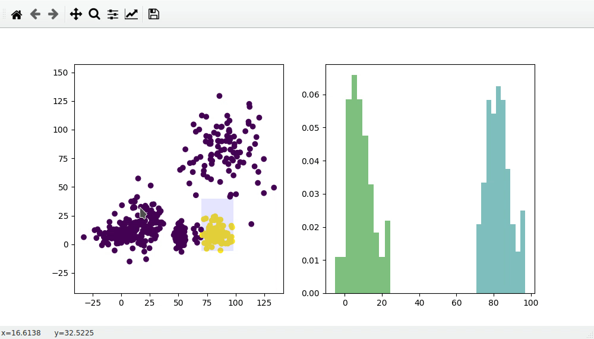

# MPL_selector
A tool to select data in matplotlib figures


### Usage

```
from mpl_selections import Selector 
import matplotlib.pyplot as plt
import numpy as np

#create some data
x = np.random.normal(100)
y = np.random.normal(100)

#plot the data
fig, ax = plt.subplots()
ax.scatter(x,y)

#create a selector object and pass the axes to do selections on
selector = Selector(ax)

```

To get the selection:

```
selection = selector.get_selection()
```
`selection` is a boolean array.

### connect functions

Whenever the mouse is released, a function can be called by the selector object. For example, to report how many items are selected you could do something like this:

```
def my_function():
    selection = selector.get_selection()
    sys.stdout.write(f"\r{sum(selection)} items currently selected")
    
selector.on_release_func = my_function
```
In this example the same `on_release_func` technique is used to plot histograms of the selected data:


